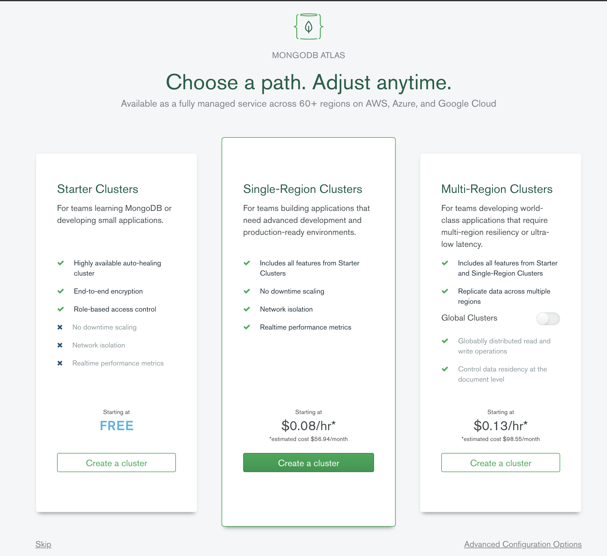
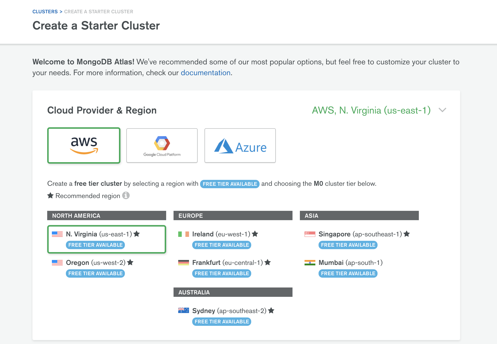
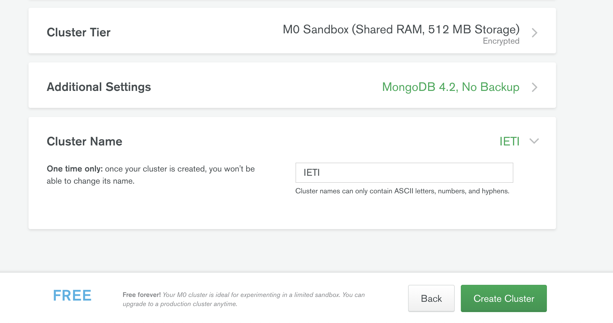
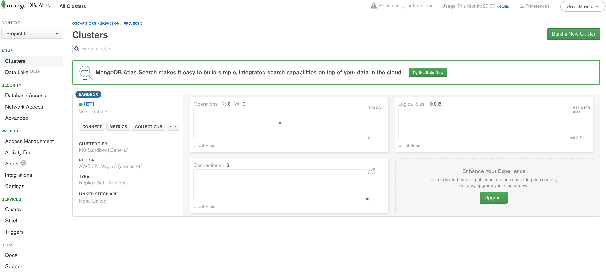
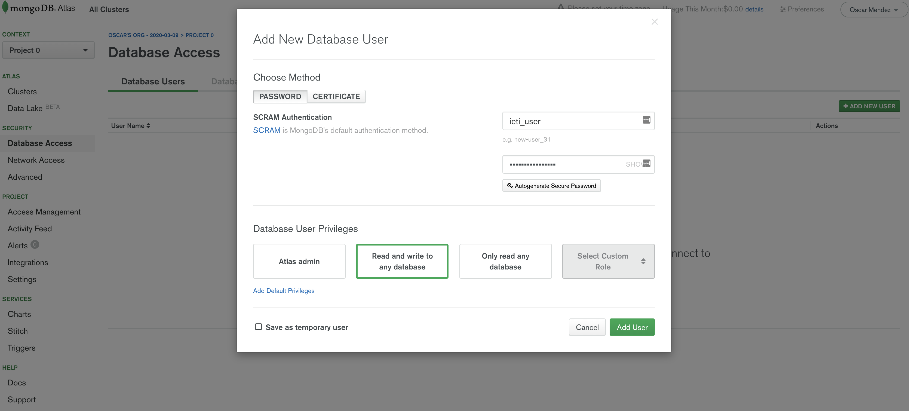
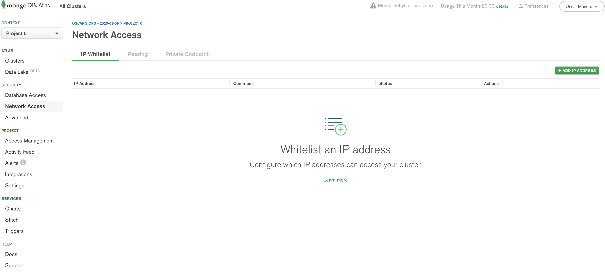
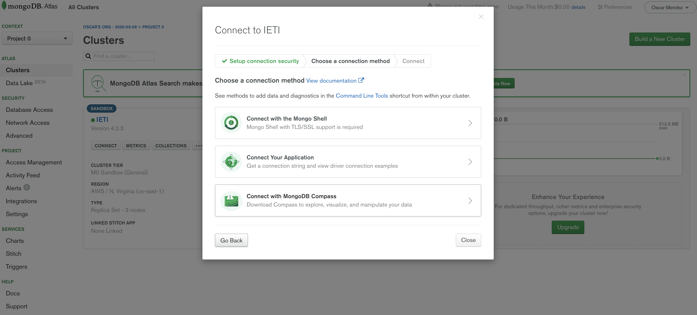
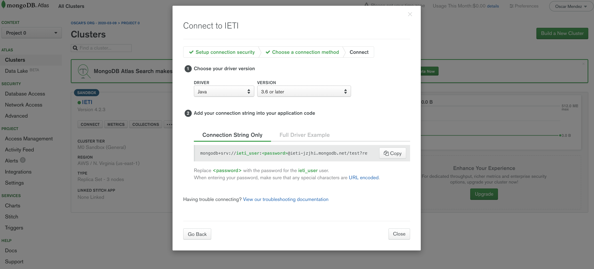
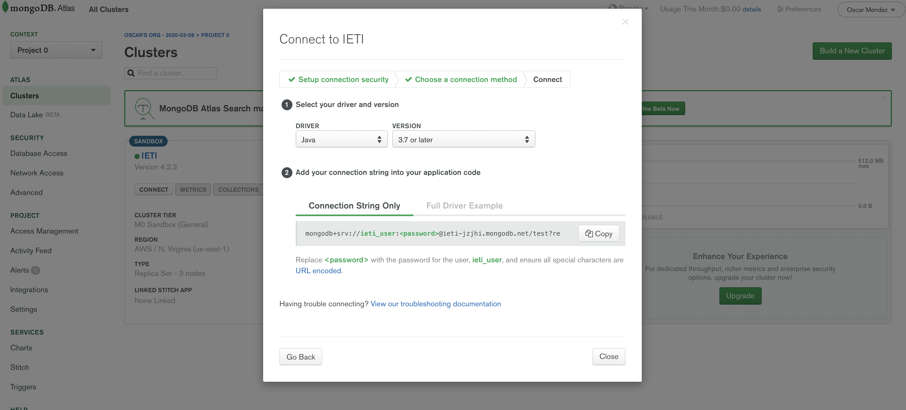
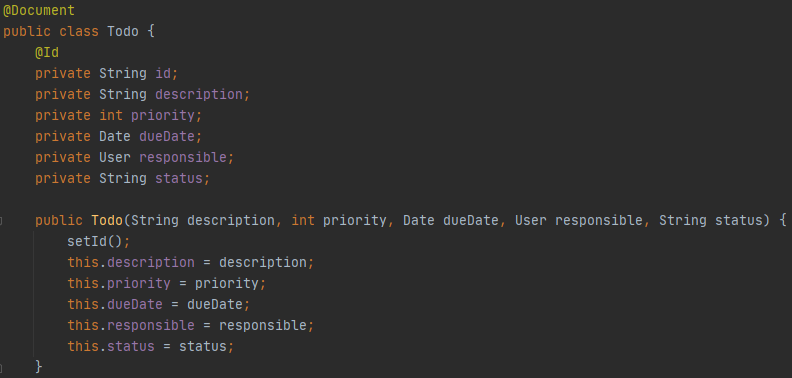

# 2.3 JPA with MongoDB
Create a Spring Boot Application that connects with MongoDB.

## Escuela Colombiana de ingeniería Julio Garavito
## IETI Laboratorio 9

### Edwin Yesid Rodriguez Maldonado

## Part 1: Basic Mongo DB configuration and Spring Boot Integration
1. Create a MongoDB Atlas account on [https://www.mongodb.com/atlas-signup-from-mlab](https://www.mongodb.com/atlas-signup-from-mlab):

    * Select the free tier:
        

2. Configure the MongoDB Cluster:
 
    * Create a new Starter Cluster (free) using any Cloud Provider and Region
   
        

     * Scroll down to _Cluster Name_ and give the cluster a name. Click on *Create Cluster*

        

    * Wait until the cluster is provisioned and gets ready

           

    * Go to Database Access menu on the left panel and create a user and a password for connecting to the DB
    
        
        
    * Go to Network Access on the left panel and add your IP so that it lets the application connect from your current IP address
    
        

        
        
    * Go to the cluster menu on the left panel and click on the _Connect_ button
    
        
        
    * Select the option *Connect Your Application* and then copy the connection string. Before using it, replace the \<password\> placeholder with the password of the user you created previously.
        
        
        
        
         
        
        
3. Clone this repo.

4. Create a new file in the root folder named *application.yml*.

5. Copy the following contents and replace the connection string placeholder with the value you got in the previous step. 

    ``` yaml
    spring:
      data:
        mongodb:
          uri: <CONNECTION_STRING> 
    ```

	

6. Run the project and verify that the connection to the database works properly. Answer the following questions:

- How many customers were created in the database?
- Where is the *findAll* method implemented?
- Suppose you have more than 1000 products in your database. How would you implement a method for supporting pagination and return pages of 50 products to your frontend?
- How many products contain the "plus" word in their description?
- How many products are returned by the *findByDescriptionContaining* query? Why?
- Which are the collection names where the objects are stored? Where are those names assigned?

[respuestas](Questions answered)

5. Create two more models (User and Todo) with the following structure:

    User
    ````Javascript
        
        {
            "id": "12354",
            "name": "Charles Darwin",
            "email": "charles@natural.com"
        }
        
     
    ````     
    
	
	
    Todo
    ````Javascript
        
        {
            "description": "travel to Galapagos",
            "priority": 10,
            "dueDate": "Jan 10 - 1860"
            "responsible": "charles@natural.com"
            "status": "pending"
        }
    ````                  
    
		
    
6. Create a repository for the _Users_ using the *CustomerRepository* as reference.

7. Create a repository for the _Todos_ using the *ProductRepository* as reference.

8. Add a *findByResponsible* method to the TodoRepository and verify it works. The method must support pagination

*Note:* You can find more information about Spring Data for Mongo DB [here](https://spring.io/projects/spring-data-mongodb) and some code samples [here](https://github.com/spring-projects/spring-data-book/tree/master/mongodb). 


## Part 2: Custom configuration and Queries

1. Create a configuration class with the following code:


2. Replace the credential values and the server address.

3. Add the following code to your Application run method to access the *MongoTemplate* object:

    ````java
    
        ApplicationContext applicationContext = new AnnotationConfigApplicationContext(AppConfiguration.class);
        MongoOperations mongoOperation = (MongoOperations) applicationContext.getBean("mongoTemplate");
     
    ````     
    
4. The *MongoOperations* instance allows you to create custom queries to access the data by using the *Query* object:
 
    ````java
    
       Query query = new Query();
       query.addCriteria(Criteria.where("firstName").is("Alice"));
    
       Customer customer = mongoOperation.findOne(query, Customer.class);
     
    ````  

5. Read some of the documentation about queries in Spring Data MongoDB:
 
    * https://www.baeldung.com/queries-in-spring-data-mongodb
    * https://www.mkyong.com/mongodb/spring-data-mongodb-query-document/

6. In the *Application* class create mocked data for 25 Todos and 10 different users (make sure the Todos have different dueDates and responsible)

7. Create the following queries using the Query class:

    * Todos where the dueDate has expired
    * Todos that are assigned to given user and have priority greater equal to 5
    * Users that have assigned more than 2 Todos.
    * Todos that contains a description with a length greater than 30 characters 

	

8. Implement the queries of the previous step using *derived query methods* in your repository interface. Is it possible to implement all of them?
